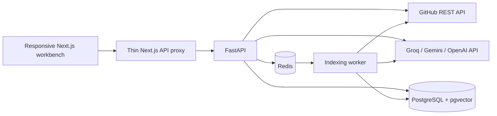

# RepoLens architecture

RepoLens is a local-first repository workbench. Next.js owns presentation and the browser-facing API boundary. FastAPI owns repository access, indexing, retrieval, answer generation, and persistence. Repository text is evidence, never executable application configuration.

## Data flow

1. A repository connection validates an HTTPS GitHub URL and resolves repository metadata.
2. Indexing resolves an immutable commit, discovers eligible text files, preserves line offsets while chunking, and stores evidence with that snapshot.
3. Retrieval uses keyword and path signals by default, with no model calls. Optional hybrid mode combines these signals with embeddings for Gemini or OpenAI. The repository and snapshot scope are part of retrieval, so evidence is not mixed between repositories.
4. Answer generation receives a bounded set of excerpts and a grounding policy. Tokens and source records reach the browser through a streaming response.
5. The inspector exposes the excerpt, path, line range, commit, and source URL; skills retain evidence paths for the same reason.

The fixture experience is a separate demonstration path. Its sample repository, questions, and answers are deterministic and labeled in the interface. It must not be used to claim that GitHub was fetched or a model provider was called.

## Local service boundaries

The Docker Compose topology uses separate web, API, worker, database, and queue services. Browser code calls the same-origin web API, keeping backend service names and provider credentials out of the client bundle. PostgreSQL and Redis are internal Compose services. Only web and API development ports are published, bound to loopback.

The API also supports a smaller local development setup; see the README for its exact commands and persistence settings. Health and readiness are separate: liveness means the HTTP process is running, while readiness reports required dependencies and configuration.

## Deployment path

Build the web image from the root Dockerfile, which uses Next.js standalone output and an unprivileged runtime user. Deploy the API and worker using the API image, with identical provider and persistence configuration. Supply managed PostgreSQL with pgvector enabled and a private Redis endpoint. Configure the web server's backend URL to the API service address and the API's allowed origins to the application origin.

Terminate TLS at a reverse proxy, disable buffering for streamed answer responses, and set timeouts long enough for indexing and generation. Database and queue services should not be public. Store provider credentials in the host's secret manager, take database backups, and test restoration before relying on durable repository history.

This showcase is not a multi-tenant hosted service. GitHub OAuth, encrypted per-user credentials, and complete tenant authorization require a separate implementation and security review before accepting private repositories or exposing this deployment publicly.

## Model provider selection

`LLM_PROVIDER` explicitly selects Groq (default), Gemini, or OpenAI in FastAPI. Groq uses a single bounded chat-completions request and keyword retrieval; it never calls another provider for embeddings. Gemini uses the native synchronous embedding API and SSE generation API through HTTPX. The browser contract remains unchanged. Gemini document and query embeddings use their corresponding retrieval task types, request 1,536 dimensions, and are normalized before persistence. Provider/model/dimension identity is stored with vectors; syncing regenerates incompatible embeddings, and retrieval excludes them until then. A missing Gemini key uses evidence-preview mode without falling back to an existing OpenAI key.

## Credit and latency controls

- `RETRIEVAL_MODE=lexical` avoids all embedding calls and vector compatibility lookups. Groq always uses this path.
- GitHub connection, parsing, technology extraction, architecture signals, exports, and onboarding are deterministic. Suggested prompts only fill the composer.
- Unchanged commits exit indexing early in lexical mode; changed commits reuse unchanged blobs.
- Chat receives five unique excerpts maximum, 7,000 evidence characters and 2,000 history characters. The default output cap is 1,200 tokens including model reasoning; GPT-OSS uses low effort.
- A 256-entry, one-hour process-local LRU reuses only complete responses. Keys include owner, repository snapshot, exact question, context, model, and prompt policy. Authorization and fresh retrieval precede cache lookup. A per-key lock coalesces simultaneous duplicates within one process. Restarting the API clears reuse; no distributed-cache claim is made.
- Groq has no automatic retries or extra hosted tools. A 429 activates a credential/model-scoped cooldown derived from Retry-After (bounded to one hour). Cached answers and non-AI features remain available.
- Public pages live at `/` and `/guide`; `/workspace` hosts repository views. UI state and themes stay in browser storage; credentials remain server-only.
